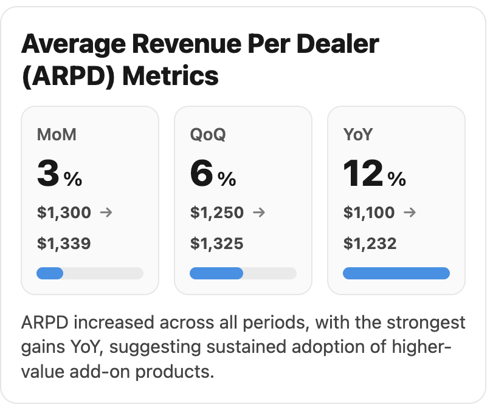
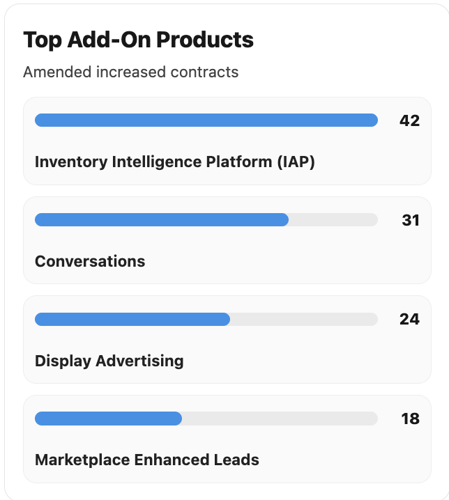

# Custom Agentforce Chart Outputs (Salesforce Demo)

This repository contains a set of **custom Lightning Web Component (LWC) visualizations** designed to be used as **Agentforce custom outputs** in Salesforce. The project demonstrates how Agentforce actions can return structured data that is rendered as rich, executive-friendly charts instead of plain text responses.

While this repository is intended for **demo and exploration purposes**, the underlying architecture closely mirrors how these patterns would be implemented in real-world Salesforce solutions.

---

## What This Repository Demonstrates

- Custom **Lightning Types** wired to LWCs via `renderer.json`
- Agentforce actions returning structured data from **Apex**
- LWCs that defensively resolve payloads passed through Agentforce
- KPI-style visualizations with tiles, bars, percentages, and currency
- Clear separation between **data generation (Apex)** and **presentation (LWC)**

---

## ARPD Metrics Visualization (Apex-driven)

![ARPD Metrics] 

The **Average Revenue Per Dealer (ARPD)** chart is the most complete and realistic use case in this repository.

### Key Characteristics

- **All data is generated in Apex**
- The Agentforce action (`AF4_GetArpdMetricsAction`) returns:
  - Month-over-Month (MoM), Quarter-over-Quarter (QoQ), and Year-over-Year (YoY) percentage changes
  - Dollar values showing **from → to** revenue per dealer
  - A narrative summary sentence
- The LWC (`arpdMetricsV4`) is responsible only for:
  - Rendering the tiles
  - Scaling bars relative to the largest percentage
  - Formatting percentages and currency
  - Displaying the summary below the chart

This mirrors a real production setup where business logic and calculations live in Apex (or upstream systems), and the UI layer remains lightweight and reusable.

---

## Agentforce Output Configuration

![ARPD Metrics Action Output Configuration]

This image shows how the **ARPD Agentforce action output** is configured to map its structured Apex response to the Lightning Type used by the renderer. This configuration allows the Agentforce response to be visualized as a chart instead of plain text.

---

## Top Products Visualization (LWC-mocked)

![Top Products] 

The **Top Add-On Products** visualization demonstrates a second charting pattern but currently uses **mocked data inside the LWC**.

### Current State

- The Lightning Type and renderer wiring is fully functional
- The chart renders correctly inside Agentforce
- Product names and values are currently hard-coded in the LWC

### Why Mocked?

There is an outstanding issue being investigated around payload binding and rendering for this use case. Mocking the data allows the UI and renderer wiring to be validated independently of that issue.

Once resolved, the mock data can be replaced with Apex-, CRM Analytics-, or Tableau-driven data without redesigning the component.

---

## How This Would Work in a Real Production Environment

### If the data lives inside Salesforce

You would typically:
- Aggregate and calculate metrics using **Apex** or **CRM Analytics (CRMA)**
- Return structured results via an Agentforce action
- Render the output using a custom LWC like the ones in this repo

This approach is ideal when:
- Data already exists in Salesforce objects
- Row-level security and sharing rules must be enforced
- Calculations belong close to the transactional data

### If the data lives outside Salesforce

You might instead:
- Use a **Tableau LWC** or analytics extension
- Pull metrics from an external data warehouse
- Let Tableau handle aggregation and visualization while Salesforce provides context

This pattern is common when:
- Metrics span multiple systems
- Large-scale analytics are required
- A centralized BI platform already exists

---

## How to Deploy

> **Important:** Due to Lightning Type → LWC binding behavior, deployment must be done in a specific order.

### Step 1: Temporarily comment out `<targetConfigs>` in LWC meta files

In each LWC `.js-meta.xml` file used by Lightning Types:
- Comment out or remove the entire `<targetConfigs>` section
- Leave the `<targets>` section intact

This prevents deployment failures caused by Lightning Types referencing LWCs that are not yet fully registered.

### Step 2: Deploy LWCs first

```bash
sf project deploy start   --source-dir "CustomAgentforceChartOutputs/force-app/main/default/lwc"   --ignore-conflicts
```

### Step 3: Deploy Lightning Types

```bash
sf project deploy start   --source-dir "CustomAgentforceChartOutputs/force-app/main/default/lightningTypes"
```

### Step 4: Restore `<targetConfigs>` and redeploy LWCs

- Uncomment or restore the `<targetConfigs>` sections in each LWC `.js-meta.xml` file

```bash
sf project deploy start   --source-dir "CustomAgentforceChartOutputs/force-app/main/default/lwc"   --ignore-conflicts
```

### Step 5 (Optional): Deploy Apex classes

```bash
sf project deploy start   --source-dir "CustomAgentforceChartOutputs/force-app/main/default/classes"
```

### Step 6: Verify in Agentforce

- Close any open Agentforce preview tabs
- Reopen the conversation or preview session
- Confirm that charts render correctly and reflect recent changes

---

## Important Notes

- This repository is **not production-ready**
- All numbers shown are **illustrative**
- The focus is on **architecture, patterns, and visualization**
- Lightning Type caching and renderer binding quirks are actively being explored

---

## Summary

This project demonstrates how **Agentforce custom outputs** can move beyond plain text and into meaningful, data-driven visualizations:

- **ARPD Metrics** shows a realistic Apex → Agentforce → LWC pipeline
- **Top Products** shows a UI-first approach while backend integration is refined
- The same architecture can support Apex, CRMA, Tableau, or external analytics

Together, these examples illustrate how Agentforce can function as an intelligent business assistant rather than just a conversational interface.
